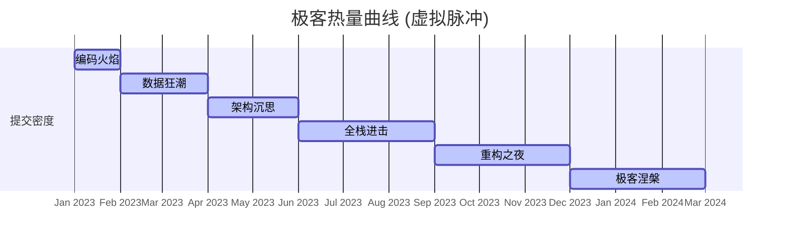

```html
<div align="center">

<!-- 顶部终端模拟 -->
<pre style="font-family: 'Courier New', monospace; background: #0d1117; padding: 1rem; border-radius: 12px; color: #00ffcc; text-align: left; display: inline-block;">
<span style="color: #fuchsia;">┌─[ root@geekstation ]─[ ~/profile ]
└─╼</span> <span style="color: #ffaa44;">$> whoami</span>
<span style="color: #88ff88;">>> 数据极客 · 全栈预备军 · 命令行艺术家</span>

<span style="color: #fuchsia;">┌─[ ~/skills ]─[ $(date +%Y) ]
└─╼</span> <span style="color: #ffaa44;">$> cat skills.txt</span>
<span style="color: #88ff88;">[PYTHON] █████████████░░░  78%  
[SQL]   ████████████░░░░░  66%  
[HTML]  ██████████████░░░  82%  
[CSS]   █████████████░░░░  74%</span>

<span style="color: #fuchsia;">└─╼</span> <span style="color: #88ff88;">_ 正在加载极客模块 ... 就绪</span>
</pre>

<!-- 彩虹分割线 -->
<svg width="100%" height="6" xmlns="http://www.w3.org/2000/svg">
  <defs>
    <linearGradient id="rainbow" x1="0%" y1="0%" x2="100%" y2="0%">
      <stop offset="0%" stop-color="#ff0000" />
      <stop offset="16%" stop-color="#ff8800" />
      <stop offset="33%" stop-color="#ffff00" />
      <stop offset="50%" stop-color="#00ff00" />
      <stop offset="66%" stop-color="#0088ff" />
      <stop offset="83%" stop-color="#4b0082" />
      <stop offset="100%" stop-color="#ee82ee" />
    </linearGradient>
  </defs>
  <rect width="100%" height="6" fill="url(#rainbow)" />
</svg>

</div>

### 📈 动态贡献曲线图

<div align="center">



```mermaid
xyChart
    x-axis [1月, 2月, 3月, 4月, 5月, 6月, 7月, 8月, 9月, 10月, 11月, 12月]
    y-axis "贡献当量" 0 --> 120
    line [45, 60, 72, 88, 105, 98, 110, 115, 102, 95, 112, 118]
    line [30, 45, 55, 70, 82, 78, 90, 95, 88, 85, 94, 102]
```

</div>

<div align="center">

<!-- 底部波浪 -->

<svg width="100%" height="80" viewBox="0 0 1200 120" preserveAspectRatio="none" xmlns="http://www.w3.org/2000/svg">
  <path d="M0,64L80,58.7C160,53,320,43,480,48C640,53,800,75,960,80C1120,85,1280,75,1360,69.3L1440,64L1440,120L1360,120C1280,120,1120,120,960,120C800,120,640,120,480,120C320,120,160,120,80,120L0,120Z" fill="url(#waveGrad)" fill-opacity="0.9"/>
  <defs>
    <linearGradient id="waveGrad" x1="0%" y1="0%" x2="100%" y2="0%">
      <stop offset="0%" stop-color="#00ffaa" stop-opacity="0.7"/>
      <stop offset="50%" stop-color="#ff44cc" stop-opacity="0.6"/>
      <stop offset="100%" stop-color="#3a86ff" stop-opacity="0.7"/>
    </linearGradient>
  </defs>
</svg>

</div>
```